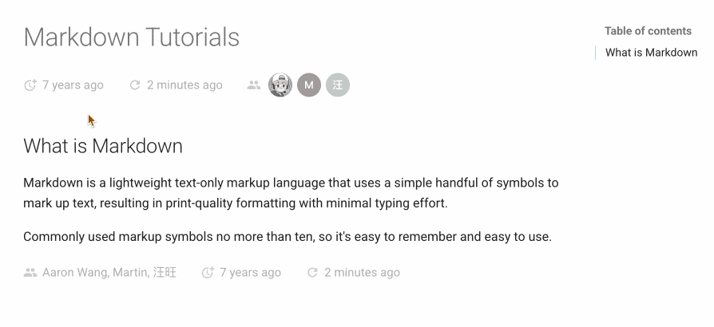

# mkdocs-document-dates

English | [简体中文](README_zh.md)


A new generation MkDocs plugin for displaying exact **creation time, last update time, authors, email** of documents

## Features

- Always display **exact** meta-info of the document for any environment (no-Git, Git, all CI/CD build systems, etc)
- Support for manually specifying time and author in `Front Matter`
- Support for multiple time formats (date, datetime, timeago)
- Flexible display position (top or bottom)
- Elegant styling (fully customizable)
- Supports Tooltip Hover Tips
    - Intelligent dynamic positioning, always floating optimally in view
    - Supports automatic theme switching following Material's light/dark color scheme
- Multi-language support, localization support, intelligent recognition of user language, automatic adaptation
- Cross-platform support (Windows, macOS, Linux)
- **Ultimate build efficiency**: O(1), no need to set env vars to distinguish runs

| PK of Build Efficiency:     | 100 md: | 1000 md: | Time Complexity: |
| --------------------------- | :-----: | :------: | :----------: |
| git-revision-date-localized |  > 3 s   |  > 30 s   |    O(n)    |
| document-dates              | < 0.1 s  | < 0.15 s  |    O(1)    |

- Supports display of recently updated documents in an overall list

## Preview



## Installation

```bash
pip install mkdocs-document-dates
```

## Configuration

Just add the plugin to your `mkdocs.yml`:

```yaml
plugins:
  - document-dates
```

Or, personalize the configuration:

```yaml
plugins:
  - document-dates:
      position: top            # Display position: top (after title)  bottom (end of document)
      type: date               # Date type: date  datetime  timeago, default: date
      exclude:                 # List of excluded files
        - temp.md              # Exclude specific file
        - drafts/*             # Exclude all files in drafts folder, including subfolders
      date_format: '%Y-%m-%d'  # Date format strings, e.g., %Y-%m-%d, %b %d, %Y, etc
      time_format: '%H:%M:%S'  # Time format strings (valid only if type=datetime)
      show_author: true        # Show author or not, default: true
      recently-updated: true   # Whether to turn on recently updated data, default: false
```

## Usage

See doc: https://jaywhj.netlify.app/document-dates-en, or read on.

<br />

## Specify time manually

The plugin will **automatically** get the exact time of the document, and will automatically cache the creation time, without manual intervention

**Priority**: `Front Matter` > `File System Timestamps(Cached)` > `Git Timestamps`

- If need to customize it, you can specify it manually in Front Matter:
    ```markdown
    ---
    created: 2023-01-01
    modified: 2025-02-23
    ---
    
    ```
- `created` can be replaced with: `created, date, creation`
- `modified` can be replaced with: `modified, updated, last_modified, last_updated`

## Configure Author

The plugin will **automatically** get the author of the document, and will automatically parse the email and then do the link, without manual intervention

**Priority**: `Front Matter` > `Git Author` > `site_author(mkdocs.yml)` > `PC Username`

- If need to customize it, you can configure an author in Front Matter with the field `name`:
    ```markdown
    ---
    name: any-name
    email: e-name@gmail.com
    ---
    
    ```

## Configure Avatar

The plugin will **automatically** loads the author avatar, without manual intervention

**Priority**: `Custom Avatar` > `GitHub Avatar` > `Character Avatar`

1. Character avatar: will be automatically generated based on the author's name with the following rules
    - Extract initials: English takes the combination of initials, other languages take the first character
    - Dynamic background color: Generate HSL color based on the hash of the name
2. GitHub avatar: will be automatically loaded by parsing the `repo_url` property in mkdocs.yml
3. Custom avatar: can be customized by customizing the author's `avatar` field in Front Matter
    ```markdown
    ---
    # Way 1: Configure a full author (fields optional)
    author:
        name: jay
        email: jay@qq.com
        avatar: https://xxx.author-avatar-URL.com/xxx.png
        url: https://xxx.website-URL.com/xxx
        description: author description
    
    # Way 2: Configure multiple authors
    authors:
        - jaywhj
        - dawang
        - sunny
    
    ---
    ```

    If you want to configure complete information for multiple authors, you can create a separate configuration file `authors.yml` in the `docs/` folder, see the [authors.yml](https://github.com/jaywhj/mkdocs-document-dates/blob/main/templates/authors.yml) for its format

## Customization

The plugin supports full customization, such as **icon, theme, color, font, animation, dividing line** etc, and the entrance has been preset, you just need to find the file below and uncomment it:

|        Category:        | Location:                               |
| :----------------------: | ---------------------------------------- |
|     **Style & Theme**     | `docs/assets/document_dates/user.config.css` |
| **Properties & Functions** | `docs/assets/document_dates/user.config.js` |


## Localization

- <mark>tooltip</mark>: built-in languages: `en zh zh_TW es fr de ar ja ko ru nl pt`, **no need to manually configure**, intelligent recognition, automatic switching
    - If there is any missing language or inaccurate built-in language, you can refer to [Part 3](https://github.com/jaywhj/mkdocs-document-dates/blob/main/mkdocs_document_dates/static/config/user.config.js) in `user.config.js` to add it by registering yourself, or submit PR for built-in
    - The original configuration item `locale` has been retained, but manual configuration is no longer recommended
- <mark>timeago</mark>: when `type: timeago` is set, timeago.js is enabled to render dynamic time, `timeago.min.js` only contains English and Chinese by default, if need to load other languages, you can configure it as below (choose one):
    - In `user.config.js`, refer to [Part 2](https://github.com/jaywhj/mkdocs-document-dates/blob/main/mkdocs_document_dates/static/config/user.config.js), add it by registering yourself
    - In `mkdocs.yml`, configure the full version of `timeago.full.min.js` to reload all languages at once
        ```yaml
        extra_javascript:
          - assets/document_dates/core/timeago.full.min.js
        ```

## Template Variables

You can access the meta-info of a document in a template using the following variables:

- page.meta.document_dates_created
- page.meta.document_dates_modified
- page.meta.document_dates_authors
- config.extra.recently_updated_docs

Usage examples:

- **Example 1**: Set the correct `lastmod` for your site's `sitemap.xml` so that search engines can better handle SEO and thus increase your site's exposure (download [sitemap.xml](https://github.com/jaywhj/mkdocs-document-dates/blob/main/templates/overrides/sitemap.xml) and override this path: `docs/overrides/sitemap.xml`)
- **Example 2**: Using the template to re-customize the plugin, you have full control over the rendering logic and the plugin is only responsible for providing the data (download [source-file.html](https://github.com/jaywhj/mkdocs-document-dates/blob/main/templates/overrides/partials/source-file.html) and override this path: `docs/overrides/partials/source-file.html`)

## Recently updated module

You can get the recently updated document data use `config.extra.recently_updated_docs` in any template, then customize the rendering logic yourself, or use the preset template examples directly:

- **Example 1**: Add the recently updated module to the navigation of the sidebar, first configure the switch `recently-updated: true`, then download [nav.html](https://github.com/jaywhj/mkdocs-document-dates/blob/main/templates/overrides/partials/nav.html) and override this path `docs/overrides/partials/nav.html` :
    ```yaml
    - document-dates:
        ...
        recently-updated: true
    ```
- **Example 2**: Add this feature anywhere in any md document, you can install the plugin [mkdocs-recently-updated-docs](https://github.com/jaywhj/mkdocs-recently-updated-docs), which is also based on the data capabilities provided by this plugin and provides more template examples, making it easier to use


## Other Tips

- In order to always get the exact creation time, a separate cache file is used to store the creation time of the document, located in the docs folder (hidden by default), please don't remove it:
    - `docs/.dates_cache.jsonl`, cache file
    - `docs/.gitattributes`, merge mechanism for cache file
- The Git Hooks mechanism is used to automatically trigger the storing of the cache (on each git commit), and the cached file is automatically committed along with it, in addition, the installation of Git Hooks is automatically triggered when the plugin is installed, without any manual intervention!
