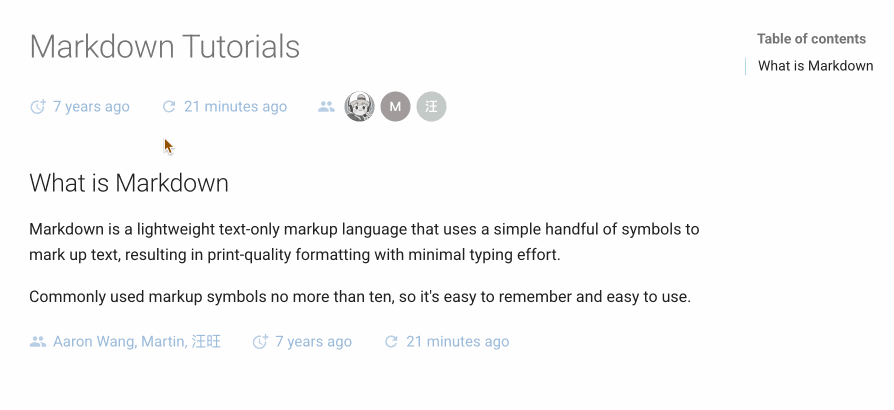

# mkdocs-document-dates

[English](README.md) | 简体中文


新一代用于显示文档确切**创建时间、最后更新时间、作者、头像、邮箱**等信息的 MkDocs 插件

## 特性

- 始终显示文档的**精确**元信息，且适用于任何环境（无 Git、Git 环境、所有 CI/CD 构建系统等）
- 支持在 `Front Matter` 中手动指定时间和作者
- 支持多种时间格式（date、datetime、timeago）
- 灵活的显示位置（顶部或底部）
- 优雅的样式设计（完全可定制）
- 支持 Tooltip 悬浮提示
    - 智能位置动态调整，始终以最佳方式浮动在视图中
    - 支持主题跟随 Material 亮/暗配色变化而变化
- 多语言支持，本地化支持，智能识别用户语言，自动适配
- 跨平台支持（Windows、macOS、Linux）
- **极致的构建效率**：O(1)，无需设置环境变量 `!ENV` 来区别运行

| 构建效率对比：                | 100个md： | 1000个md： | 时间复杂度： |
| --------------------------- | :------: | :-------: | :---------: |
| git-revision-date-localized |  > 3 s   |  > 30 s   |    O(n)     |
| document-dates              | < 0.1 s  | < 0.15 s  |    O(1)     |

- 支持整体列表显示最近更新的文档功能

## 预览


## 安装

```bash
pip install mkdocs-document-dates
```

## 配置

在你的 mkdocs.yml 中添加插件即可：

```yaml
plugins:
  - document-dates
```

或者，你要个性化配置：

```yaml
plugins:
  - document-dates:
      position: top            # 显示位置：top（标题后） bottom（文档末尾）
      type: date               # 时间类型：date datetime timeago，默认：date
      exclude:                 # 排除文件列表
        - temp.md              # 排除指定文件
        - drafts/*             # 排除 drafts 目录下所有文件，包括子目录
      date_format: '%Y-%m-%d'  # 日期格式化字符串，例如：%Y年%m月%d日、%b %d, %Y
      time_format: '%H:%M:%S'  # 时间格式化字符串（仅在 type=datetime 时有效）
      show_author: true        # 是否显示作者信息，默认：true
      recently-updated: true   # 是否开启最近更新的数据，默认：false
```

## 用法

参见文档：https://jaywhj.netlify.app/document-dates-zh，或继续向下阅读

<br />

## 手动指定时间

插件会**自动获取**文档的精确时间信息，会自动缓存创建时间，无需人工干预

**优先级**：`Front Matter` > `文件系统时间戳(缓存)` > `Git时间戳`

- 如需要自定义，则可在 Front Matter 中手动指定：
    ```markdown
    ---
    created: 2023-01-01
    modified: 2025-02-23
    ---
    
    ```
- `created` 可替换为：`created, date, creation`
- `modified` 可替换为：`modified, updated, last_modified, last_updated`

## 配置作者

插件会**自动获取**文档的作者信息，会自动解析邮件后做链接，无需人工干预

**优先级**：`Front Matter` > `Git作者` > `site_author(mkdocs.yml)` > `PC用户名` 

- 如需要自定义，在 Front Matter 中通过字段 `name` 就可配置一个作者：
    ```markdown
    ---
    name: any-name
    email: e-name@gmail.com
    ---
    
    ```

## 配置头像

插件会**自动加载**作者头像，无需人工干预

**优先级**：`自定义头像` > `GitHub头像` > `字符头像` 

1. 字符头像：会根据作者姓名自动生成，规则如下
    - 提取 initials：英文取首字母组合，中文取首字
    - 动态背景色：基于名字哈希值生成 HSL 颜色
2. GitHub头像：会解析 mkdocs.yml 中的 `repo_url` 属性自动加载
3. 自定义头像：可在 Front Matter 中通过自定义作者的 `avatar` 字段进行自定义
    ```markdown
    ---
    # 方式1：配置一个完整的作者(字段可选配)
    author:
        name: jay
        email: jay@qq.com
        avatar: https://xxx.author-avatar-URL.com/xxx.png
        url: https://xxx.website-URL.com/xxx
        description: author description
    
    # 方式2：配置多个作者
    authors:
        - jaywhj
        - dawang
        - sunny
    
    ---
    ```

    如果要配置多个作者的完整信息，则可在 `docs/` 目录下新建单独的配置文件 `authors.yml`，格式参考 [authors.yml](https://github.com/jaywhj/mkdocs-document-dates/blob/main/templates/authors.yml) 

## 插件定制化

插件支持完全自定义，比如**图标、主题、颜色、字体、动画、分界线**等，已经预置了入口，你只需要找到下方文件取消里面的注释即可：

|    类别：    | 位置：                                         |
| :---------: | --------------------------------------------- |
| **样式与主题** | `docs/assets/document_dates/user.config.css` |
| **属性与功能** | `docs/assets/document_dates/user.config.js`  |



## 语言本地化

- <mark>tooltip</mark>：内置语言：`en zh zh_TW es fr de ar ja ko ru nl pt`，**无需手动配置**，智能识别，自动切换
    - 如语言缺失或内置语言不准确，可在 `user.config.js` 中，参考 [Part 3](https://github.com/jaywhj/mkdocs-document-dates/blob/main/mkdocs_document_dates/static/config/user.config.js)，自行注册添加，也可以提交 PR 内置
    - 保留了原来的配置项 `locale`，但已经不建议手动配置了
- <mark>timeago</mark>：当设置 `type: timeago` 时，会启用 timeago.js 来渲染动态时间，timeago.min.js 默认只包含英文和中文，如需加载其他语言，可以按如下方式配置（2选1）：
    - 在 `user.config.js` 中，参考 [Part 2](https://github.com/jaywhj/mkdocs-document-dates/blob/main/mkdocs_document_dates/static/config/user.config.js)，自行注册添加
    - 在 `mkdocs.yml` 中，配置 full 版本的 timeago.full.min.js，一次性重载所有语言
        ```yaml
        extra_javascript:
          - assets/document_dates/core/timeago.full.min.js
        ```

## 模板变量

你可以在模板中使用如下变量访问文档的元信息：

- page.meta.document_dates_created
- page.meta.document_dates_modified
- page.meta.document_dates_authors
- config.extra.recently_updated_docs

应用示例：

- **示例1**：为你站点的 sitemap.xml 设置正确的 `lastmod`，以便搜索引擎能更好的处理 SEO，从而提高你网站的曝光率（下载 [sitemap.xml](https://github.com/jaywhj/mkdocs-document-dates/blob/main/templates/overrides/sitemap.xml) 后覆盖：`docs/overrides/sitemap.xml`）
- **示例2**：利用模板重新定制插件，你可以完全掌控渲染逻辑，插件只负责提供数据（下载 [source-file.html](https://github.com/jaywhj/mkdocs-document-dates/blob/main/templates/overrides/partials/source-file.html) 后覆盖：`docs/overrides/partials/source-file.html`）

## 最近更新模块

可在任意模板中通过 `config.extra.recently_updated_docs` 获取最近更新的文档数据，然后自行定制渲染逻辑，或者直接使用预置的模板示例：

- **示例1**：在侧边栏的导航中添加最近更新的模块，先配置开关 `recently-updated: true`，然后下载 [nav.html](https://github.com/jaywhj/mkdocs-document-dates/blob/main/templates/overrides/partials/nav.html) 后覆盖 `docs/overrides/partials/nav.html` ：
    ```yaml
    - document-dates:
        ...
        recently-updated: true
    ```
- **示例2**：在任意md文档的任意位置添加此功能，则可安装插件 [mkdocs-recently-updated-docs](https://github.com/jaywhj/mkdocs-recently-updated-docs)，也是基于此插件提供的数据能力拓展的，提供了更多的模板示例，使用起来更简单


## 其它提示

- 为了始终能获取准确的创建时间，采用了单独的缓存文件来存储文档的创建时间，位于 docs 目录下（默认是隐藏的），请不要删除：
    - `docs/.dates_cache.jsonl`，缓存文件
    - `docs/.gitattributes`，缓存文件的合并机制
- 采用了 Git Hooks 机制来自动触发缓存的存储（在每次执行 git commit 时），缓存文件也会随之自动提交，并且 Git Hooks 的安装在插件被安装时也会自动触发，全程无需任何手动干预
