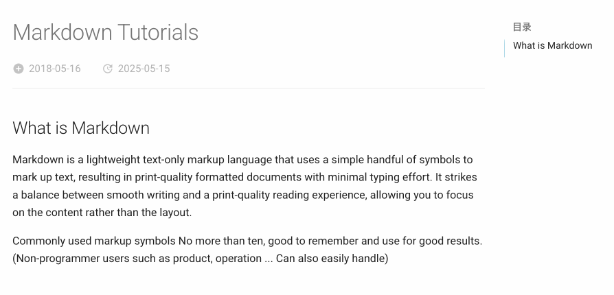

# mkdocs-document-dates

[English](README.md) | 简体中文

<br />

新一代用于显示文档确切**创建时间、最后更新时间、作者、头像、邮箱**等信息的 MkDocs 插件



## 特性

- [x] 始终显示文档的**精确**元信息，且适用于任何环境（无 Git、Git 环境、Docker 容器、所有 CI/CD 构建系统等）
- [x] 支持在 `Front Matter` 中手动指定时间和作者
- [x] 支持多种时间格式（date、datetime、timeago）
- [x] 支持多种作者模式（头像、文本、隐藏）
- [x] 灵活的显示位置（顶部或底部）
- [x] 优雅的样式设计（完全可定制）
- [x] 智能 Tooltip 悬浮提示
- [x] 支持列表显示最近更新的文档
- [x] 多语言支持，本地化支持，智能识别用户语言，自动适配
- [x] 跨平台支持（Windows、macOS、Linux）
- [x] **极致的构建效率**：O(1)，无需设置环境变量 `!ENV` 来区别运行

| 构建效率对比：                | 100个md： | 1000个md： | 时间复杂度： |
| --------------------------- | :------: | :-------: | :---------: |
| git-revision-date-localized |  > 3 s   |  > 30 s   |    O(n)     |
| document-dates              | < 0.1 s  | < 0.15 s  |    O(1)     |

## 安装

```bash
pip install mkdocs-document-dates
```

## 配置

在你的 mkdocs.yml 中添加插件即可：

```yaml
plugins:
  - document-dates
```

或者，完整配置：

```yaml
plugins:
  - document-dates:
      position: top            # 显示位置: top(标题后) bottom(文档末尾)
      type: date               # 时间类型: date datetime timeago, 默认：date
      exclude:                 # 排除文件列表
        - temp.md                  # 示例：排除指定文件
        - blog/*                   # 示例：排除 blog 目录下所有文件，包括子目录
      date_format: '%Y-%m-%d'  # 日期格式化字符串（例如：%Y年%m月%d日、%b %d, %Y）
      time_format: '%H:%M:%S'  # 时间格式化字符串（仅在 type=datetime 时有效）
      show_author: true        # 作者显示模式: true(头像) text(文本) false(隐藏)
      recently-updated: true   # 是否开启最近更新的数据，默认：false
```

## 自定义设置

除了以上基础配置外，插件还提供了丰富的自定义选项，可满足各种个性化需求：

- [指定日期时间](https://jaywhj.netlify.app/document-dates-zh#%E6%8C%87%E5%AE%9A%E6%97%A5%E6%9C%9F%E6%97%B6%E9%97%B4)：可手动指定每个文档的创建时间和最后更新时间
- [指定作者](https://jaywhj.netlify.app/document-dates-zh#%E6%8C%87%E5%AE%9A%E4%BD%9C%E8%80%85)：可手动指定每个文档的作者信息
- [指定头像](https://jaywhj.netlify.app/document-dates-zh#%E6%8C%87%E5%AE%9A%E5%A4%B4%E5%83%8F)：可手动指定每个作者的头像
- [设置插件样式](https://jaywhj.netlify.app/document-dates-zh#%E8%AE%BE%E7%BD%AE%E6%8F%92%E4%BB%B6%E6%A0%B7%E5%BC%8F)：如图标、主题、颜色、字体、动画、分界线等
- [添加本地化语言](https://jaywhj.netlify.app/document-dates-zh#%E6%B7%BB%E5%8A%A0%E6%9C%AC%E5%9C%B0%E5%8C%96%E8%AF%AD%E8%A8%80)：为 `timeago` 和 `tooltip` 补充更多本地化语言
- [使用模板变量](https://jaywhj.netlify.app/document-dates-zh#%E4%BD%BF%E7%94%A8%E6%A8%A1%E6%9D%BF%E5%8F%98%E9%87%8F)：可用于优化 sitemap.xml 以便优化站点 SEO、可用于重新定制插件等
- [添加最近更新模块](https://jaywhj.netlify.app/document-dates-zh#%E6%B7%BB%E5%8A%A0%E6%9C%80%E8%BF%91%E6%9B%B4%E6%96%B0%E6%A8%A1%E5%9D%97)：启用最近更新的文档列表
- [其它提示](https://jaywhj.netlify.app/document-dates-zh#%E5%85%B6%E5%AE%83%E6%8F%90%E7%A4%BA)：介绍了技术原理、缓存机制，以及在 Docker 中如何使用
- [开发小故事](https://jaywhj.netlify.app/document-dates-zh#%E5%BC%80%E5%8F%91%E5%B0%8F%E6%95%85%E4%BA%8B)：描述了插件的由来、开发遇到的难点及解决方案、产品设计原则与方向

具体内容参见文档：https://jaywhj.netlify.app/document-dates-zh
