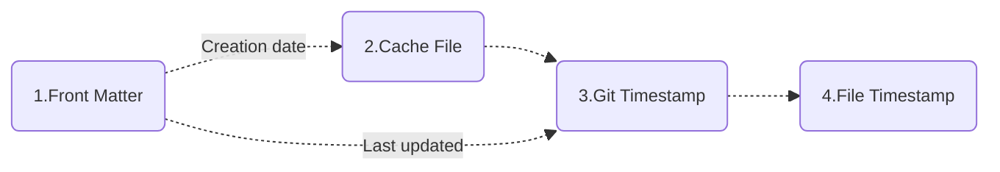
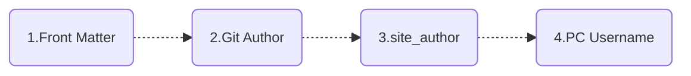
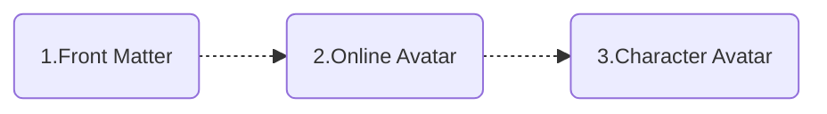

# mkdocs-document-dates

<p align="center">
English | <a href="document-dates-zh.html">简体中文</a>
</p>

[mkdocs-document-dates](https://github.com/jaywhj/mkdocs-document-dates), a new generation MkDocs / ProperDocs plugin for displaying exact **creation date, last updated date, authors, email** of documents.


## Features

- Works in any environment (no-Git, Git environments, Docker, all CI/CD build systems, etc.)
- Support list display of recently updated documents (in descending order of update date)
- Support for manually specifying date and author in `Front Matter`
- Support for multiple date formats (date, datetime, timeago)
- Support for multiple author modes (avatar, text, hidden)
- Support for manually configuring author's name, link, avatar, email, etc.
- Flexible display position (top or bottom)
- Elegant styling (fully customizable)
- Multi-language support, localization support, intelligent recognition of user language, automatic adaptation
- **Ultimate build efficiency**: O(1), no need to set the env var `!ENV` to distinguish runs

    | Build Speed Comparison:     | 100 md: | 1000 md: | Time Complexity: |
    | --------------------------- | :-----: | :------: | :----------: |
    | git-revision-date-localized<br /><br />git-authors |  <br />＞ 3 s   |  <br />＞ 30 s   |    <br />O(n)    |
    | document-dates              | ＜ 0.1 s  | ＜ 0.15 s  |    O(1)     |

## Installation

The [**MaterialX for MkDocs**](https://github.com/jaywhj/mkdocs-materialx){target="_blank"} theme has this plugin built-in, if you are using this theme, no separate installation is required.

If you wish to use it independently, you may install it via `pip`:

```bash
pip install mkdocs-document-dates
```

## Configuration

Add the following lines to `mkdocs.yml` / `properdocs.yml`:

```yaml
plugins:
  - document-dates
```

Or, common configuration:

```yaml
plugins:
  - document-dates:
      position: top            # Display position: top(after title) bottom(end of document), default: top
      type: date               # Date type: date datetime timeago, default: date
      exclude:                 # List of excluded files (support unix shell-style wildcards)
        - temp.md                  # Example: exclude the specified file
        - blog/*                   # Example: exclude all files in blog folder, including subfolders
        - '*/index.md'             # Example: exclude all index.md files in any subfolders
```

The following configuration options are supported:

| Option | Valid value | Default | Description |
| :-- | :-- | :-- | :-- |
| **position** | `top`, `bottom` | `top` | specify the display position of the plugin |
| **type** | `date`, `datetime`, `timeago` | `date` | specify the type of date to be displayed |
| **exclude** | [] | none | specify a list of excluded files |
| **date_format** |  | '%Y-%m-%d' | specify the date formatting string |
| **time_format** |  | '%H:%M:%S' | specify the time formatting string, valid only if type=datetime |
| **show_created** | `true`, `false` | `true` | specify whether to display the creation date |
| **show_updated** | `true`, `false` | `true` | specify whether to display the last updated date |
| **show_author** | `true`(avatar), `false`(hidden), `text`(text) | `true` | specify the type of author display |

## Settings

The plugin provides a wide range of customization options to meet various personalized needs.

### Date & Time

The date data is retrieved using a combination of different methods to adapt to various runtime environments, including no-Git environments, Git, Docker containers, and all CI/CD build systems:

- Uses **filesystem timestamp** to ensure accurate original dates in local no-Git environments
- Uses **Git timestamp** to ensure relatively accurate dates in Git environments
- Uses **cache file** to ensure accurate original dates in Git environments
- Front Matter: Manually specify the date in Front Matter if you prefer not to use automatic dates

??? desc "Why not use filesystem timestamps in Git environments ?"

    Because files are recreated during git checkout or git clone, causing the original timestamps of branches/files to be lost after cloning or checking out.

#### Loading order

By default, the plugin will **automatically load** the document's "creation date" and "last updated date" in the following order.



<!--
- [x] Creation date: `Front Matter` > `Cache File` > `Git Timestamp` > `File Timestamp`
- [x] Last updated: `Front Matter` > `Git Timestamp` > `File Timestamp`
-->

!!! quote ""

    === "Creation date"

        1. Prioritize reading the custom creation date in Front Matter
        2. Then read the creation date in the cache file
        3. Next read the document’s first git commit date as the creation date
        4. Finally read the file’s creation time
    
    === "Last updated"

        1. Prioritize reading the custom last updated date in Front Matter
        2. Then read the document’s last git commit date as the last updated date
        3. Finally read the file’s modification time

#### Customization

This can be specified in Front Matter using the following fields:

- Creation date: `created`, `date`
- Last updated: `updated`, `modified`

```yaml
---
created: 2023-01-01
updated: 2025-02-23
---
```

#### Cache creation date

In the Git environment, the plugin reads the document's "first git commit date" as the creation date by default. However, if you need to retrieve the original creation date of the document (earlier than the first git commit), you can manually install Git hooks to use a caching mechanism to solve this issue. Navigate to the target repository directory in the terminal and execute the following command to install Git hooks:

```
mdd-hooks
```

> This command installs the pre-commit hook locally in the root directory of the target repository, located at `.githooks/pre-commit`.

Afterwards, every time you execute `git commit`, the cache file containing the creation date will be automatically generated (hidden by default) in the docs directory, and this cache file will also be committed automatically.

- `docs/.dates_cache.jsonl`, cache file
- `docs/.gitattributes`, merge mechanism for cache file

This method is compatible with CI/CD build systems, which will automatically detect and load the cache file.

#### Configure git fetch depth

In the CI/CD system, if the "creation date" uses the "first git commit date" (i.e., no custom or cache file date), you need to configure `git fetch depth` in the CI system to retrieve the correct first git commit record. For example:

```yaml hl_lines="6 7" title=".github/workflows/ci.yaml"
jobs:
  deploy:
    runs-on: ubuntu-latest
    steps:
      - uses: actions/checkout@v4
        with:
          fetch-depth: 0
```

!!! quote ""

    - **Github** Actions: set `fetch-depth` to `0` ([docs](https://github.com/actions/checkout))
    - **Gitlab** Runners: set `GIT_DEPTH` to `0` ([docs](https://docs.gitlab.com/ee/ci/pipelines/settings.html#limit-the-number-of-changes-fetched-during-clone))
    - **Bitbucket** pipelines: set `clone: depth: full` ([docs](https://support.atlassian.com/bitbucket-cloud/docs/configure-bitbucket-pipelinesyml/))
    - **Azure** Devops pipelines: set `Agent.Source.Git.ShallowFetchDepth` to something very high like `10e99` ([docs](https://docs.microsoft.com/en-us/azure/devops/pipelines/repos/pipeline-options-for-git?view=azure-devops#shallow-fetch))

### Author

#### Loading order

The plugin will **automatically** loads the author information of the document in the following order, and will automatically parse the email and then do the linking.



<!--
- [x] `Front Matter` > `Git Author` > `site_author(mkdocs.yml)` > `PC Username`
-->

!!! quote ""

    === "Description"
    
        1. Prioritize reading custom authors in Front Matter
        2. Then read the Git author
        3. Next read the site_author in mkdocs.yml
        4. Finally read the PC username

#### Customization

Can be configured in Front Matter in the following ways:

1) Configure a simple author: via field `name`

```yaml
---
name: any-name
email: e-name@gmail.com
---
```

2) Configure one or more authors: via field `authors`

```yaml
---
authors:
  - jaywhj
  - dawang
  - sunny
---
```

#### Enhanced author configuration

For a better user experience, you can add full configuration for all authors. To do so, create an `authors.yml` file in the `docs/` folder using the format below:

```yaml title="docs/authors.yml"
authors:
  jaywhj:
    name: Aaron Wang
    avatar: https://xxx.com/avatar.jpg
    url: https://jaywhj.netlify.app/
    email: junewhj@qq.com
    description: Minimalism
  user2:
    name: xxx
    avatar: assets/avatar.png
    url: https://xxx.com
    email: xxx@gmail.com
    description: xxx
```

When the author name in `Front Matter`, `Git Author`, `site_author(mkdocs.yml)` matches the key in `authors`, the full author information of the key will be automatically loaded.

#### Git author aggregation

Git author support account aggregation, i.e. multiple different email accounts for the same person can be aggregated to show the same author, which can be configured by providing a `.mailmap` file in the repository root directory, this is also a feature of Git itself, see [gitmailmap](https://git-scm.com/docs/gitmailmap) for more details.

The following example unifies my other Git accounts and displays them as `Aaron <junewhj@qq.com>`:

```yaml title=".mailmap"
Aaron <junewhj@qq.com> <aaron@gmail.com>
Aaron <junewhj@qq.com> <aaron@AarondeMacBook-Pro.local>
Aaron <junewhj@qq.com> aaron <aaronwqt@icloud.com>
```

### Avatar

#### Loading order

The plugin will **automatically** loads the author avatar in the following order.



<!--
- [x] `Front Matter` > `Online Avatar` > `Character Avatar`
-->

#### Customization 

Customizable via `avatar` field in [Enhanced author configuration](#Enhanced-author-configuration) (supports URL paths and local file paths).

#### Other avatars

!!! quote ""

    === "Online avatar"

        Load from Gravatar or Weavatar based on Git's `user.email`

    === "Character avatar"

        Automatically generated based on the author's name with the following rules:
        1. Extract initials: English takes the combination of initials, other languages take the first character
        2. Generate dynamic background color: Generate HSL color based on the hash of the name

### Structure and Style

You can configure the display structure of the plugin in the following ways in either mkdocs.yml or Front Matter.

#### Configuration structure

**Global Toggle**, configured in mkdocs.yml:

```yaml title="mkdocs.yml"
plugins:
  - document-dates:
      ...
      show_created: true    # Show creation date: true false, default: true
      show_updated: true    # Show last updated date: true false, default: true
      show_author: true     # Show author: true(avatar) text(text) false(hidden), default: true 
```

**Local Toggle**, configured in Front Matter (using the same field names):

```yaml
---
show_created: true
show_updated: true
show_author: text
---
```

!!! warning "Note"

    When used in combination, the global toggle acts as the master switch, and the local toggle only takes effect when the master switch is enabled. This does not follow the logic of local configurations overriding global ones.

#### Configuration style

You can quickly set the plugin styles through preset entrances, such as **icons, themes, colors, fonts, animations, dividing line** and so on. Download the config template file into `docs/assets/document_dates/` and uncomment it:

|        Category:        | Location:                  |
| :----------------------: | -------------------------- |
|     **Style & Theme**     | [docs/assets/document_dates/config.css](https://raw.githubusercontent.com/jaywhj/mkdocs-document-dates/main/mkdocs_document_dates/static/config/config.css) |
| **Properties & Functions** | [docs/assets/document_dates/config.js](https://raw.githubusercontent.com/jaywhj/mkdocs-document-dates/main/mkdocs_document_dates/static/config/config.js) |

### Template Variables

You can use these variables in any template or plugin to access document metadata:

```py
page.meta.document_dates.dates.created
page.meta.document_dates.dates.updated
page.meta.document_dates.authors
config.extra.recently_updated_docs
```

#### Set correct `lastmod` for sitemap

You can set the correct `lastmod` for your site's `sitemap.xml` with the template variable `document_dates.dates.updated` so that search engines can better handle SEO and thus increase your site's exposure

Step: Download the sample template [sitemap.xml](https://github.com/jaywhj/mkdocs-document-dates/blob/main/templates/overrides/sitemap.xml), and override this path `docs/overrides/sitemap.xml`

#### Recustomize plugin

The plugin can be re-customized using templates, you have full control over the rendering logic and the plugin is only responsible for providing the data

Step: Download the sample template [source-file.html](https://github.com/jaywhj/mkdocs-document-dates/blob/main/templates/overrides/partials/source-file.html), and override this path `docs/overrides/partials/source-file.html`, then freely customize the template code

### Recently Updated Module

The recent updates module displays site documentation information in a structured way, which is ideal for sites with **a large number of documents or frequent updates**, allowing readers to **quickly see what's new**.


You can get the recently updated document data (in descending order of update date) in any template via the variable `config.extra.recently_updated_docs`, then customize the rendering logic yourself.

Or just use the preset template:

- Display recently updated documents in descending order by update time, list items are dynamically updated
- Support multiple view modes including list, detail and grid
- Support automatic extraction of article summaries, no manual configuration required
- Support for customizing article cover in Front Matter

#### Config switch

First, configure the switch of `recently-updated` in `document-dates`:

```yaml title="mkdocs.yml"
- document-dates:
    ...
    recently-updated:
      limit: 10        # Limit the number of docs displayed
      exclude:         # Exclude documents you don't want to show (support unix shell-style wildcards)
        - index.md
        - blog/*
```

#### Add to sidebar navigation

Download the sample template [nav.html](https://github.com/jaywhj/mkdocs-document-dates/blob/main/templates/overrides/partials/nav.html), and override this path `docs/overrides/partials/nav.html`

#### Add anywhere in document

Insert this line anywhere in your document:

```yaml
<!-- RECENTLY_UPDATED_DOCS -->
```

#### Configure article cover

You can specify an article cover in Front Matter using the field `cover` (supports URL paths and local file paths):

```yaml
---
cover: assets/cat.jpg
---
```

#### Summary Line Configuration

The plugin intelligently parses article content and simply refine the summary without manual configuration. The number of summary lines can be configured separately for **grid** and **detail** views:

```yaml hl_lines="9-11"
plugins:

  - document-dates:
      type: timeago
      exclude: ['index.md', '*/index.md', 'blog/*']
      recently-updated:
        limit: 10
        exclude: ['index.md', 'tags.md', '*/index.md', 'blog/*']
        summary_lines:
          grid: 4
          detail: 6
```

#### Reading Time Estimation

The plugin intelligently analyzes article content, extracts valid information and estimates reading time.

- Supports calculation for various Markdown blocks, including tables, fenced blocks, math blocks, images and more
- Supports all mainstream languages and mixed-language
    - Space-delimited languages: English, Spanish, French, German, Portuguese, Russian ...
    - CJK languages: Chinese, Japanese, Korean

**Calculation Rules**

| Valid Element | Calculation Method | Notes |
| --- | --- | --- |
| Space-delimited languages | 240 words / min | Based on common industry standards |
| CJK languages | 480 characters / min | Based on common industry standards |
| Tables | 2s / row | Simple row-based estimation for variable-length content |
| Fence blocks | 1s / row | Includes code blocks, text blocks, YAML blocks, etc. |
| Math blocks | 4s / block | Rough estimation based on individual blocks |
| Images | 2s / image | Typical for blog post images: 2~3 seconds per image |
| Front Matter | Skipped | Generally not visible after rendering |
| HTML blocks | Skipped | Images inside HTML are counted, other content ignored (Markdown-focused) |
| Quotes & links | Skipped | Link text for href is generally not visible after rendering |
| Other invalid characters | Skipped | For example, whitespace, blank lines, special symbols, markup characters, etc. |

This reading time calculation function is exposed publicly. You may call it from any plugin or hook to get the estimated reading time and concise summary of Markdown content. Refer to [analyze_markdown](#analyze_markdown).

**Configure Reading Speed**

Reading speed varies by language, content type and personal reading habits. The default values are set based on average user behavior. You may manually adjust the speed if the defaults do not match your actual usage.

```yaml
plugins:

  - document-dates:
      readtime_wpm: 240        # for Space-delimited languages
      readtime_wpm_cjk: 480    # for CJK languages
```

### Localization Language

The plugin's `tooltip` and `timeago` have built-in multi-language support, and the `locale` is automatically detected, so you don't need to configure it manually. If any language is missing, you can add it for them.

#### For tooltip

Built-in locales: `en zh zh_TW es fr de ar ja ko ru nl pt`

Addition Method (choose one): 

- In `config.js`, refer to [Part 3](https://github.com/jaywhj/mkdocs-document-dates/blob/main/mkdocs_document_dates/static/config/config.js) to add it by registering yourself
- Submit a PR for Inclusion

#### For timeago

When `type: timeago` is set, the timeago.js library is enabled for dynamic time rendering. The built-in locales in `timeago.min.js` only include `en zh`. If you need to load other languages, you can configure it as described below (choose one):

- In `config.js`, refer to [Part 2](https://github.com/jaywhj/mkdocs-document-dates/blob/main/mkdocs_document_dates/static/config/config.js) to add it by registering yourself
- In `mkdocs.yml`, configure the full version of `timeago.full.min.js` to reload [all locales](https://github.com/hustcc/timeago.js/tree/master/src/lang)
  ```yaml title="mkdocs.yml"
  extra_javascript:
    - assets/document_dates/core/timeago.full.min.js
  ```

## Developer API

This plugin also exposes the following APIs for developers, making it easy to retrieve exact dates, reading time and other information in other plugins or hooks.

### load_dates_and_authors

You can use this function to retrieve the date and author information for all site documents at once, it returns either Git or file-system-based dates and authors for each document.

!!! quote ""

    **load_dates_and_authors(docs_dir_path: Path, files: Files)**

    Parameters:

    - `docs_dir_path` (Path) - path to the docs directory of the project
    - `files` (Files) - global files collection

    Returns:

    - `Dict[str, Dict[str, Any]]` - a dictionary containing all documents, built from the document relative path, date, author, and other information

The return data structure is as follows:

``` json
{
    'index.md': {
        'created': datetime.datetime(2025,1,28,16,50,13,tzinfo=datetime.timezone.utc),
        'updated': datetime.datetime(2026,4,13,9,38,13,331080,tzinfo=datetime.timezone.utc),
        'authors': [
            {'name': name, 'email': email, 'avatar': avatar, 'url': url, 'description': description},
            ...
        ]
    },

    ...
}
```

An example of calling the function is shown below:

``` py { data-download }
from pathlib import Path
from datetime import datetime

try:
    from mkdocs_document_dates.utils import load_dates_and_authors
except ImportError:
    load_dates_and_authors = None


def __init__(self):
    super().__init__()
    self.date_data = {}

# First, call the API in `Global Events` to read data and store it
def on_files(self, files, config):

    if load_dates_and_authors is not None:
        # If the date plugin is enabled, load the data directly from the plugin; otherwise, get it from the API
        dd_plugin = config.plugins.get("document-dates")
        if dd_plugin:
            self.date_data = dd_plugin.data_cached
        else:
            self.date_data = load_dates_and_authors(Path(config.docs_dir), files)

    # Continue with the original logic

    return files

# Then, access the data via the relative path of page.file in `Page Events`
def on_page_markdown(self, markdown, page, config, files):

    entry = self.date_data.get(page.file.src_uri, {})

    created = entry.get("created")
    updated = entry.get("updated")

    authors = entry.get("authors", [])
    for author in authors:
        author.name
        author.email
        author.avatar
        author.url
        author.description
    ...
```

!!! warning "Note"

    - Do not call this function in [Page Events](https://properdocs.org/dev-guide/plugins/#page-events){target="_blank"}, it should only be called **once** in [Global Events](https://properdocs.org/dev-guide/plugins/#global-events){target="_blank"}. For the event lifecycle, please refer to [Events](https://properdocs.org/dev-guide/plugins/#events){target="_blank"}.
    - This function does not parse Markdown content, so dates and authors defined in frontmatter need to be handled separately. For example, you may first try to retrieve manually configured dates and authors from frontmatter, and fall back to calling this function to get such information if those values are not present, like this:
    ``` py { data-fold="0" }
    ...

    def _parse_date(self, value: str | None, default: datetime | None) -> datetime | None:
        if not value:
            return default
        try:
            return datetime.fromisoformat(value).astimezone()
        except ValueError:
            return default

    def on_page_markdown(self, markdown, page, config, files):

        entry = self.date_data.get(page.file.src_uri, {})

        # Overrides default values via meta fields
        created = self._parse_date(page.meta.get("created"), entry.get("created"))
        updated = self._parse_date(page.meta.get("updated"), entry.get("updated"))

        ...
    ```

### analyze_markdown

You can use this function to get the estimated reading time and concise summary of Markdown content.

!!! quote ""

    **analyze_markdown(md: str, readtime_wpm: int = 240, readtime_wpm_cjk: int = 480)**

    Parameters:

    - `md` (str) - markdown text
    - `readtime_wpm` (int, **optional**) - reading speed per minute for Space-delimited languages (English, Spanish, French, German, Portuguese, Russian, etc.), default is 240 words/min
    - `readtime_wpm_cjk` (int, **optional**) - reading speed per minute for CJK languages (Chinese, Japanese, Korean), default is 480 chars/min

    Returns:

    - `tuple[int, str]`
        - `readtime` (int) - reading time in minutes
        - `summary` (str) - a concise summary of Markdown content

A sample call is shown below:

```py
from mkdocs_document_dates.utils import analyze_markdown

def on_page_markdown(self, markdown, page, config, files):

    readtime, summary = analyze_markdown(markdown)
    ...
```

If you only need the reading time, call it like this:

```py
from mkdocs_document_dates.utils import analyze_markdown

def on_page_markdown(self, markdown, page, config, files):

    readtime, *_ = analyze_markdown(markdown)
    ...
```

Refer to [Reading Time Estimation](#Reading-Time-Estimation) for reading time calculation rules.


## Development Stories

A dispensable, insignificant little plug-in, friends who have time can take a look \^\_\^ 

- **Origin**:
    - Because [git-revision-date-localized](https://github.com/timvink/mkdocs-git-revision-date-localized-plugin), a great project. When I used it at the end of 2024, I found that I couldn't use it locally because my mkdocs documentation was not included in git management, I don't understand why not read the file timestamp, but to use the git timestamp, and the file timestamp is exact, then raised an issue to the author, but didn't get a reply for about a week (the author had a reply later, nice guy, I guess he was busy at the time), and then I thought, why not try it myself, and so it was born, in February 2025
- **Iteration**:
    - After development, I understood why not use file timestamp, because files will be rebuilt when they go through `git checkout` or `git clone`, resulting in the loss of the original timestamp of the branch/file that was cloned or checked out. There are many solutions:
        - Method 1: Use the last git commit date as the last updated date and the first git commit date as the creation date, `git-revision-date-localized` does this. (This way, there will be a margin of error and dependency on git)
        - Method 2: Cache the original date in advance, and then read the cache subsequently (The date is exact and no dependency on any environment). The cache can be in Front Matter of the source document or in a separate file, I chose the latter. Storing in Front Matter makes sense and is easier, but this will modify the source content of the document, although it doesn't have any impact on the body, but I still want to ensure the originality of the data!
        - Method 3: Configure a custom script [git-restore-mtime](https://github.com/chetan/git-restore-mtime-action) in the CI system to automatically restore the original file timestamps
- **Difficulty**:
    1. When to read and store original date? This is just a plugin for mkdocs, with very limited access and permissions, mkdocs provides only build and serve, so in case a user commits directly without executing build or serve (e.g., when using a CI/CD build system), then you won't be able to retrieve the date of the file, not to mention caching it!
        - Straight to the point: using the Git Hooks mechanism, you can trigger custom scripts when specific Git actions occur, such as every time you make a commit (hook installation is optional)
    2. How can I ensure that a single cache file does not conflict when collaborating with multi-person?
        - Workaround: use JSONL instead of JSON, and with the merge strategy `merge=union`
    3. How to speed up the build when there are more documents ( > 200 )? Every time you fetch a git information, it's usually a file I/O operation, and if there are a lot of files, it can slow down the build considerably, which is intolerable for users (e.g., `git-revision-date-localized` can only improve the preview speed by adding the environment variable `enabled: !ENV` to disable itself locally, which is a bit like burying one's head in the sand)
        - Solution: skip unnecessary I/O access and reduce the number of I/O operations
- **Improve**:
    - Since it's a newly developed plugin, it will be designed in the direction of **excellent products**, and the pursuit of the ultimate **ease of use, simplicity, personalization, intelligence**
        - **Ease of use**: no complex configuration, only 2-3 commonly used configuration items, one-click templates are also provided for personalized 
        - **Simplicity**: no unnecessary configuration, no-Git dependencies, no CI/CD configuration dependencies, no other package dependencies
        - **Personalization**: fully customizable and full control over the rendering logic, the plugin is only responsible for providing the data
        - **Intelligence**: Intelligent parsing of document date, author, avatar, intelligent recognition of the user's language and automatic adaptation
        - **Compatibility**: works well on older operating systems and browsers, such as Windows 7, MacOS 10, iOS 12, Chrome 63

## Comments Section