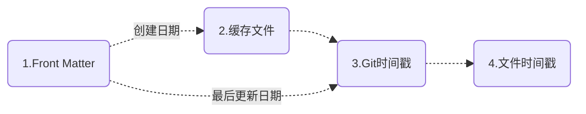
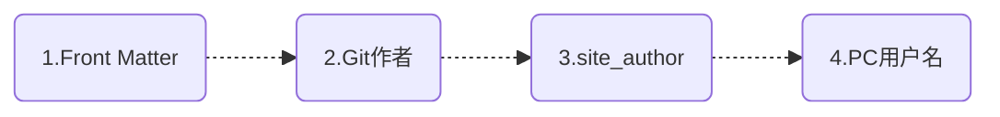
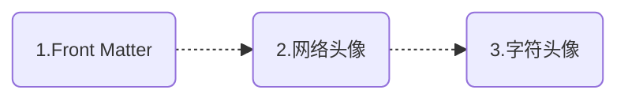

# MkDocs 日期作者头像插件

<p align="center">
<a href="document-dates-en.html">English</a> | 简体中文
</p>

[mkdocs-document-dates](https://github.com/jaywhj/mkdocs-document-dates)，新一代用于显示文档确切**创建日期、最后更新日期、作者、头像、邮箱**等信息的 MkDocs / ProperDocs 插件


## 特性

- 适用于任何环境：无 Git、Git 环境、Docker 容器、所有 CI/CD 构建系统等
- 支持列表显示最近更新的文档（按更新日期倒序排列）
- 支持在 `Front Matter` 中手动指定日期和作者
- 支持多种日期格式（date、datetime、timeago）
- 支持多种作者模式（头像、文本、隐藏）
- 支持手动配置作者的姓名、链接、头像、邮箱等
- 灵活的显示位置（顶部或底部）
- 优雅的样式设计（完全可定制）
- 多语言支持，本地化支持，智能识别用户语言，自动适配
- **极致的构建效率**：O(1)，无需设置环境变量 `!ENV` 来区别运行

    | 构建速度对比：                | 100个md： | 1000个md： | 时间复杂度： |
    | --------------------------- | :------: | :-------: | :---------: |
    | git-revision-date-localized<br /><br />git-authors |  <br />＞ 3 s   |  <br />＞ 30 s   |    <br />O(n)    |
    | document-dates              | ＜ 0.1 s  | ＜ 0.15 s  |    O(1)     |

## 安装

[MaterialX for MkDocs](https://github.com/jaywhj/mkdocs-materialx){target="_blank"} 主题已内置了此插件，如果你正在使用此主题，无需单独安装。

如果你需要单独使用，则可以用 `pip` 安装:

```bash
pip install mkdocs-document-dates
```

## 配置选项

在 `mkdocs.yml` / `properdocs.yml` 中添加以下行：

```yaml
plugins:
  - document-dates
```

或者，常用配置：

```yaml
plugins:
  - document-dates:
      position: top       # 显示位置: top(标题后) bottom(文档末尾), 默认: top
      type: date          # 日期类型: date datetime timeago, 默认: date
      exclude:            # 排除文件列表（支持 unix shell 样式的通配符）
        - temp.md             # 示例：排除指定文件
        - blog/*              # 示例：排除 blog 目录下所有文件，包括子目录
        - '*/index.md'        # 示例：排除所有子目录下的 index.md 文件
```

支持以下配置选项：

| 选项 | 有效值 | 默认值 | 描述 |
| :-- | :-- | :-- | :-- |
| **position** | `top`, `bottom` | `top` | 指定插件的显示位置 |
| **type** | `date`, `datetime`, `timeago` | `date` | 指定日期显示的类型 |
| **exclude** | [] | none | 指定排除文件列表 |
| **date_format** |  | '%Y-%m-%d' | 指定日期格式化字符串 |
| **time_format** |  | '%H:%M:%S' | 指定时间格式化字符串, 仅当 type=datetime 时有效 |
| **show_created** | `true`, `false` | `true` | 指定是否显示创建日期 |
| **show_updated** | `true`, `false` | `true` | 指定是否显示最后更新日期 |
| **show_author** | `true`(头像), `false`(隐藏), `text`(文本) | `true` | 指定作者显示的类型 |

## 功能设置

插件提供了丰富的自定义选项，可满足各种个性化需求

### 日期时间

日期数据的获取采用了多种不同形式的组合，以适配各种运行环境，支持无 Git 环境、Git 环境、Docker 容器、所有 CI/CD 构建系统等：

- 采用 **文件系统时间戳**：确保在本地无 Git 环境中，能获取原始的准确日期
- 采用 **Git 时间戳**：确保在 Git 环境中，能获取相对准确的日期
- 采用 **缓存文件**：确保在 Git 环境中，能获取原始的准确日期
- Front Matter：如果你不想采用自动化日期，则可以在 Front Matter 中手动指定

??? desc "为什么在 Git 环境中不采用文件系统时间戳 ?"

    因为文件在经过 git checkout 或 git clone 时会被重建，从而导致克隆或检出后的分支/文件的原始时间戳丢失

#### 加载顺序

默认，插件会按以下顺序 **自动加载** 文档的「创建日期」和「最后更新日期」



<!--
- [x] 创建日期：`Front Matter` > `缓存文件` > `Git时间戳` > `文件时间戳`
- [x] 最后更新：`Front Matter` > `Git时间戳` > `文件时间戳`
-->

!!! quote ""

    === "创建日期"
    
        1. 优先读取 Front Matter 中的自定义创建日期
        2. 其次读取缓存文件中的创建日期
        3. 再次读取文档「首次 git commit 日期」作为创建日期
        4. 最后读取文件的创建时间
    
    === "最后更新日期"
    
        1. 优先读取 Front Matter 中的自定义最后更新日期
        2. 其次读取文档「最近一次 git commit 日期」作为最后更新日期
        3. 最后读取文件的修改时间

#### 自定义日期

可在 Front Matter 中通过以下字段指定

- 创建日期：`created`, `date`
- 最后更新：`updated`, `modified`

```yaml
---
created: 2023-01-01
updated: 2025-02-23
---
```

#### 缓存创建日期

在 Git 环境中，默认会读取文档的「首次 git commit 日期」作为创建日期，但如果你需要获取文档被创建时的原始日期（早于首次 git commit），则可以选择手动安装 Git hooks 以采用缓存机制来解决此问题。在终端里导航到目标仓库目录，执行以下命令安装 Git hooks:

```
mdd-hooks
```

> 此命令会在目标仓库的根目录局部安装 pre-commit 钩子，位于 `.githooks/pre-commit`

此后，在你每次执行 `git commit` 时，会自动生成含创建日期的缓存文件，位于 docs 目录下（默认隐藏），并且缓存文件也会随之自动 commit

- `docs/.dates_cache.jsonl`，缓存文件
- `docs/.gitattributes`，缓存文件的合并机制

此方式，支持 CI/CD 构建系统，会自动识别缓存文件并加载

#### 配置 Git 抓取深度

在 CI/CD 系统中，如果「创建日期」采用的是「首次 git commit 日期」（即无自定义和缓存文件日期），那你需要在 CI 系统中配置 `git fetch depth`，以获取正确的首次 git commit 记录，例如：

```yaml hl_lines="6 7" title=".github/workflows/ci.yaml"
jobs:
  deploy:
    runs-on: ubuntu-latest
    steps:
      - uses: actions/checkout@v4
        with:
          fetch-depth: 0
```

!!! quote ""

    - **Github** Actions: set `fetch-depth` to `0` ([docs](https://github.com/actions/checkout))
    - **Gitlab** Runners: set `GIT_DEPTH` to `0` ([docs](https://docs.gitlab.com/ee/ci/pipelines/settings.html#limit-the-number-of-changes-fetched-during-clone))
    - **Bitbucket** pipelines: set `clone: depth: full` ([docs](https://support.atlassian.com/bitbucket-cloud/docs/configure-bitbucket-pipelinesyml/))
    - **Azure** Devops pipelines: set `Agent.Source.Git.ShallowFetchDepth` to something very high like `10e99` ([docs](https://docs.microsoft.com/en-us/azure/devops/pipelines/repos/pipeline-options-for-git?view=azure-devops#shallow-fetch))

### 作者

#### 加载顺序

插件会按以下顺序 **自动加载** 文档的作者信息，会自动解析邮件后做链接



<!--
- [x] `Front Matter` > `Git作者` > `site_author(mkdocs.yml)` > `PC用户名`
-->

!!! quote ""

    === "说明"
    
        1. 优先读取 Front Matter 中的自定义作者
        2. 其次读取 Git 作者
        3. 再次读取 mkdocs.yml 中的 site_author
        4. 最后读取 PC用户名

#### 自定义作者

可在 Front Matter 中通过以下方式配置：

1) 配置一个简单作者：通过字段 `name`

```yaml
---
name: any-name
email: e-name@gmail.com
---
```

2) 配置一个或多个作者：通过字段 `authors`

```yaml
---
authors:
  - jaywhj
  - dawang
  - sunny
---
```

#### 增强作者配置

可为所有作者补充完整信息配置，以丰富用户体验。在 `docs/` 目录下创建一个 `authors.yml` 文件，格式如下：

```yaml title="docs/authors.yml"
authors:
  jaywhj:
    name: Aaron Wang
    avatar: https://xxx.com/avatar.jpg
    url: https://jaywhj.netlify.app/
    email: junewhj@qq.com
    description: Minimalism
  user2:
    name: xxx
    avatar: assets/avatar.png
    url: https://xxx.com
    email: xxx@gmail.com
    description: xxx
```

当 `Front Matter`、`Git作者`、`site_author(mkdocs.yml)` 中的作者名跟 authors 中的 key 匹配时，会自动加载 key 对应的完整作者信息

#### Git作者聚合

Git作者支持账户聚合，即同一人的多个不同邮箱账户可聚合显示为同一作者，可通过在仓库根目录提供一个 `.mailmap` 文件来配置，这也是 Git 本身的一个功能，详情见 [gitmailmap](https://git-scm.com/docs/gitmailmap)

以下示例将我的其它 Git 账户统一聚合，显示为 `Aaron <junewhj@qq.com>`：

```yaml title=".mailmap"
Aaron <junewhj@qq.com> <aaron@gmail.com>
Aaron <junewhj@qq.com> <aaron@AarondeMacBook-Pro.local>
Aaron <junewhj@qq.com> aaron <aaronwqt@icloud.com>
```

### 头像

#### 加载顺序

插件会按以下顺序 **自动加载** 作者头像



<!--
- [x] `Front Matter` > `网络头像` > `字符头像`
-->

#### 自定义头像

可通过 [增强作者配置](#增强作者配置) 中的 `avatar` 字段进行自定义（支持 URL 路径和本地文件路径）

#### 其它头像

!!! quote ""

    === "网络头像"
    
        根据 Git 的 `user.email` 从 Gravatar 或 Weavatar 加载
    
    === "字符头像"
    
        根据作者姓名自动生成，规则如下：
        1. 提取 initials：英文取首字母组合，中文取首字
        2. 生成动态背景色：基于名字哈希值生成 HSL 颜色

### 结构与样式

#### 配置结构

可在 mkdocs.yml 或 Front Matter 中通过以下方式配置插件的显示结构

**全局开关**，在 mkdocs.yml 中配置：

```yaml title="mkdocs.yml"
plugins:
  - document-dates:
      ...
      show_created: true    # 显示创建日期: true false, 默认: true
      show_updated: true    # 显示最后更新日期: true false, 默认: true
      show_author: true     # 显示作者: true(头像) text(文本) false(隐藏), 默认: true 
```

**局部开关**，在文档的 Front Matter 中配置（字段一样）：

```yaml
---
show_created: true
show_updated: true
show_author: text
---
```

!!! warning "注意"

    组合使用时，全局开关是总闸，只有在总闸开启时局部开关才有效，不是局部覆盖全局逻辑

#### 配置样式

可通过预置入口快速设置插件样式，比如 **图标、主题、颜色、字体、动画、分界线** 等。下载 config 模板文件到 `docs/assets/document_dates/` 目录下，然后取消里面的注释即可：

|    类别：    | 位置：                |
| :---------: | -------------------- |
| **样式与主题** | [docs/assets/document_dates/config.css](https://raw.githubusercontent.com/jaywhj/mkdocs-document-dates/main/mkdocs_document_dates/static/config/config.css) |
| **属性与功能** | [docs/assets/document_dates/config.js](https://raw.githubusercontent.com/jaywhj/mkdocs-document-dates/main/mkdocs_document_dates/static/config/config.js) |

### 模板变量

你可以在任意模板或插件中使用如下变量访问文档的元信息：

```
page.meta.document_dates.dates.created
page.meta.document_dates.dates.updated
page.meta.document_dates.authors
config.extra.recently_updated_docs
```

#### 为 sitemap 设置正确的 lastmod

可以通过模板变量 `document_dates.dates.updated` 为你站点的 `sitemap.xml` 设置正确的 `lastmod`，以便搜索引擎能更好的处理 SEO，从而提高你网站的曝光率

步骤：下载示例模板 [sitemap.xml](https://github.com/jaywhj/mkdocs-document-dates/blob/main/templates/overrides/sitemap.xml)，覆盖路径 `docs/overrides/sitemap.xml`

#### 重新定制插件

可以利用模板重新定制插件，你可以完全掌控渲染逻辑，插件只负责提供数据

步骤：下载示例模板 [source-file.html](https://github.com/jaywhj/mkdocs-document-dates/blob/main/templates/overrides/partials/source-file.html)，覆盖路径 `docs/overrides/partials/source-file.html`，然后自由定制模板中的代码

### 最近更新模块

最新更新模块会以结构化的方式展示站点的文档信息，这非常适合**文档数量众多或更新频繁**的网站，这样读者可以**快速查看最新内容**


你可在任意模板中通过 `config.extra.recently_updated_docs` 变量获取最近更新的文档数据（按更新日期倒序排列），然后自行定制渲染逻辑

或者直接使用预设模板：

- 按更新时间倒序显示最近更新的文档，列表项动态更新
- 支持列表、详情、网格等多种视图模式
- 支持自动提取文章摘要，无需手动设置
- 支持在 Front Matter 中自定义文章封面

#### 配置开关

首先，在 `document-dates` 中配置开关 `recently-updated`：

```yaml title="mkdocs.yml"
- document-dates:
    ...
    recently-updated:
        limit: 10        # 限制显示的文档数量
        exclude:         # 排除不想显示的文档（支持 unix shell 样式的通配符）
          - index.md
          - blog/*
```

#### 添加到侧边栏导航中

下载示例模板 [nav.html](https://github.com/jaywhj/mkdocs-document-dates/blob/main/templates/overrides/partials/nav.html)，覆盖路径 `docs/overrides/partials/nav.html`

#### 添加到文档的任意位置

在文档中任意位置插入这一行：

```yaml
<!-- RECENTLY_UPDATED_DOCS -->
```

#### 配置文章封面

可在 Front Matter 中使用字段 `cover` 指定文章封面（支持 URL 路径和本地文件路径）：

```yaml
---
cover: assets/cat.jpg
---
```

#### 配置摘要行数

插件会智能解析文章内容，简单提炼摘要，无需手动设置。可为 grid 和 detail 视图分别配置摘要的显示行数：

```yaml hl_lines="9-11"
plugins:

  - document-dates:
      type: timeago
      exclude: ['index.md', '*/index.md', 'blog/*']
      recently-updated:
        limit: 10
        exclude: ['index.md', 'tags.md', '*/index.md', 'blog/*']
        summary_lines:
          grid: 4
          detail: 6
```

#### 阅读时长预估

插件会智能解析文章内容，提取有效信息并预估阅读时长。

- 支持各种 Markdown 内容块的计算，如表格、栅栏块、数学块、图像等
- 支持所有主流语言，支持混合语言
    - 空格分隔型语言：英语、西班牙语、法语、德语、葡萄牙语、俄语等
    - CJK 语言：中文、日语、韩语

**计算规则**

| 有效元素 | 计算方式 | 备注 |
| ------- | ------ | ---- |
| 空格分隔型语言 | 240 词 / 分钟 | 参考行业建议值 |
| CJK 语言 | 480 字 / 分钟 | 参考行业建议值 |
| 表格 | 2 秒 / 行 | 简单一点按行计算 |
| 围栏 | 1 秒 / 行 | 包含代码块、普通文本块、YAML 块等 |
| 数学公式块 | 4 秒 / 个 | 粗略的估算，按个来算 |
| 图片 | 2 秒 / 个 | 博客类文章配图，一般 2 ~ 3 秒就够 |
| Front Matter | 跳过不处理 | 渲染后一般不可见 |
| HTML 块 | 跳过不处理 | HTML 中的图片会被计算，其它的忽略，以标准 Markdown 内容为主 |
| 引用与链接 | 跳过不处理 | 链接文本的 href 文本在渲染后通常不可见 |
| 其它无效字符| 跳过不处理 | 空格 / 空白行 / 特殊标点符号 / 标记符号 ... |

该阅读时间计算函数是公开的，你可以从任何插件或钩子中调用它，以获取 Markdown 内容的预估阅读时长和精简摘要，具体见 [analyze_markdown](#analyze_markdown)。

**配置阅读速率**

阅读速率因语种、内容类型、阅读习惯的不同而不同，默认值是以大多数用户的习惯或速率为基准而配置，如你发现默认值与实际情况相差甚远，你也可以手动调整阅读速率。

```yaml
plugins:

  - document-dates:
      readtime_wpm: 240        # 用于空格分隔型语言
      readtime_wpm_cjk: 480    # 用于 CJK 语言
```

### 本地化语言

插件的 `tooltip` 和 `timeago` 内置了多语言支持，并且会自动识别 `locale`，无需手动配置。如有语言缺失，则可为它们补充：

#### 对于 tooltip

内置语言：`en zh zh_TW es fr de ar ja ko ru nl pt`

补充方式（2选1）：

- 在 `config.js` 中，参考 [Part 3](https://github.com/jaywhj/mkdocs-document-dates/blob/main/mkdocs_document_dates/static/config/config.js)，自行注册添加
- 提交 PR 以供纳入

#### 对于 timeago

当设置 `type: timeago` 时，将启用 timeago.js 库以进行动态时间渲染，`timeago.min.js` 内置的语言仅包含 `en zh`，如需加载其他语言，可以按如下方式配置（2选1）：

- 在 `config.js` 中，参考 [Part 2](https://github.com/jaywhj/mkdocs-document-dates/blob/main/mkdocs_document_dates/static/config/config.js)，自行注册添加
- 在 `mkdocs.yml` 中，配置 full 版本的 `timeago.full.min.js`，一次性重载 [所有区域语言](https://github.com/hustcc/timeago.js/tree/master/src/lang)
  ```yaml title="mkdocs.yml"
  extra_javascript:
    - assets/document_dates/core/timeago.full.min.js
  ```

## 开发者 API

插件为开发人员提供了以下 API，便于在其他插件或钩子中获取精确日期、阅读时长和其他信息。

### load_dates_and_authors

你可以使用此函数一次性检索站点所有文档的日期和作者信息，它会返回每个文档基于 Git 或文件系统的日期和作者。

!!! quote ""

    **load_dates_and_authors(docs_dir_path: Path, files: Files)**
    
    Parameters:
    
    - `docs_dir_path` (Path) - 项目文档目录路径
    - `files` (Files) - 全部文件集合
    
    Returns:
    
    - `Dict[str, Dict[str, Any]]` - 根据文档相对路径、日期、作者和其他信息建立的包含所有文档的字典

返回数据结构如下：

``` json
{
    'index.md': {
        'created': datetime.datetime(2025,1,28,16,50,13,tzinfo=datetime.timezone.utc),
        'updated': datetime.datetime(2026,4,13,9,38,13,331080,tzinfo=datetime.timezone.utc),
        'authors': [
            {'name': name, 'email': email, 'avatar': avatar, 'url': url, 'description': description},
            ...
        ]
    },

    ...
}
```

调用该函数的示例如下：

``` py { data-download }
from pathlib import Path
from datetime import datetime

try:
    from mkdocs_document_dates.utils import load_dates_and_authors
except ImportError:
    load_dates_and_authors = None


def __init__(self):
    super().__init__()
    self.date_data = {}

# First, call the API in `Global Events` to read data and store it
def on_files(self, files, config):

    if load_dates_and_authors is not None:
        # If the date plugin is enabled, load the data directly from the plugin; otherwise, get it from the API
        dd_plugin = config.plugins.get("document-dates")
        if dd_plugin:
            self.date_data = dd_plugin.data_cached
        else:
            self.date_data = load_dates_and_authors(Path(config.docs_dir), files)

    # Continue with the original logic

    return files

# Then, access the data via the relative path of page.file in `Page Events`
def on_page_markdown(self, markdown, page, config, files):

    entry = self.date_data.get(page.file.src_uri, {})

    created = entry.get("created")
    updated = entry.get("updated")

    authors = entry.get("authors", [])
    for author in authors:
        author.name
        author.email
        author.avatar
        author.url
        author.description
    ...
```

!!! warning "注意"

    - 不要在 [Page Events](https://properdocs.org/dev-guide/plugins/#page-events){target="_blank"} 中调用该函数，应仅在 [Global Events](https://properdocs.org/dev-guide/plugins/#global-events){target="_blank"} 中调用一次。关于事件生命周期，请参见 [Events](https://properdocs.org/dev-guide/plugins/#events){target="_blank"}
    - 该函数不解析 Markdown 内容，因此 frontmatter 中的日期和作者需要单独处理。例如，你可以优先获取用户在 frontmatter 中手动配置的日期与作者，如果不存在这些值，再调用此函数来获取这些信息，像这样：
    ``` py { data-fold="0" }
    ...
    
    def _parse_date(self, value: str | None, default: datetime | None) -> datetime | None:
        if not value:
            return default
        try:
            return datetime.fromisoformat(value).astimezone()
        except ValueError:
            return default
    
    def on_page_markdown(self, markdown, page, config, files):
    
        entry = self.date_data.get(page.file.src_uri, {})
    
        # Overrides default values via meta fields
        created = self._parse_date(page.meta.get("created"), entry.get("created"))
        updated = self._parse_date(page.meta.get("updated"), entry.get("updated"))
    
        ...
    ```

### analyze_markdown

你可以使用此函数来获取 Markdown 内容的预估阅读时长和简明摘要。

!!! quote ""

    **analyze_markdown(md: str, readtime_wpm: int = 240, readtime_wpm_cjk: int = 480)**
    
    Parameters:
    
    - `md` (str) - Markdown 内容
    - `readtime_wpm` (int, **optional**) - 空格分隔语言（英语、西班牙语、法语、德语、葡萄牙语、俄语等）的每分钟阅读速率，默认为 240 词/分钟
    - `readtime_wpm_cjk` (int, **optional**) - 无空格分隔语言（中日韩）的每分钟阅读速率，默认为 480 字/分钟
    
    Returns:
    
    - `tuple[int, str]`
        - `readtime` (int) - 阅读时间（分）
        - `summary` (str) - 简明摘要

调用示例如下：

```py
from mkdocs_document_dates.utils import analyze_markdown

def on_page_markdown(self, markdown, page, config, files):

    readtime, summary = analyze_markdown(markdown)
    ...
```

如果只想保留 readtime，则可以这么调用：

```py
from mkdocs_document_dates.utils import analyze_markdown

def on_page_markdown(self, markdown, page, config, files):

    readtime, *_ = analyze_markdown(markdown)
    ...
```

阅读时长计算规则见 [阅读时长预估](#阅读时长预估)。

## 开发小故事

一个可有可无、微不足道的小插件，没事的朋友可以看看 \^\_\^ 

- **起源**：
    - 是因为 [git-revision-date-localized](https://github.com/timvink/mkdocs-git-revision-date-localized-plugin) ，一个很棒的项目。在2024年底使用时，发现我这本地用不了，因为我的 mkdocs 文档没有纳入 git 管理，然后我就不理解为什么不读取文件时间戳，而要用 git 时间戳，而且文件时间戳更准确，还给作者提了 issue，结果等了一周左右没得到回复（后面作者回复了，人不错，估计他当时在忙没来得及），然后就想要不自己试试，就诞生了，诞生于2025年2月
- **迭代**：
    - 开发后，就理解了为什么不采用文件时间戳，因为文件在经过 git checkout 或 git clone 时会被重建，从而导致克隆或检出后的分支/文件的原始时间戳丢失，解决办法有很多：
        - 方法 1，采用最近一次 git commit 日期作为文档的最后更新日期，采用首次 git commit 日期作为文档的创建日期，`git-revision-date-localized` 就是这么做的（这种方式，存在一定的误差且无法在无Git环境中使用）
        - 方法 2，可以提前缓存原始日期，后续读缓存就可以了（日期准确且不依赖任何环境）。缓存的地方，可以是源文档的 Front Matter 中，也可以是单独的文件，我选择了后者。存储在 Front Matter 中非常合理且更简单，但是这样会修改文档的源内容，虽然对正文无任何影响，但是我还是想保证数据的原始性
        - 方法 3，在 CI 系统中配置自定义脚本 [git-restore-mtime](https://github.com/chetan/git-restore-mtime-action) 以自动恢复文件的原始时间戳
- **难点**：
    1. 什么时候去读取和存储原始日期？这只是 mkdocs 的一个插件，入口和权限非常有限，mkdocs 提供的只有 build 和 serve，那万一用户不执行 build 或 serve 而直接 commit 呢（比如使用 CI/CD 构建系统时），那样你就无法获取文件的日期了，更别说缓存了
        - 直接说结论：利用 Git Hooks 机制，能在特定的 git 动作发生时触发自定义脚本，比如每次 commit 时（需选配安装 hook）
    2. 在多人协作时，如何保证单独的缓存文件不冲突？
        - 我的方案：采用 JSONL 代替 JSON，配合并集的合并策略 `merge=union`
    3. 在文档较多时( > 200 )，如何加快构建速度？通常每次获取 git 信息都是一次文件 I/O 操作，如果文件较多，就会大大影响构建速度，这让用户没法忍受（比如，`git-revision-date-localized` 只能通过添加环境变量 `enabled: !ENV` 在本地禁用自己来提高预览速度，这有点掩耳盗铃的感觉）
        - 解决办法：跳过不必要的 I/O 访问，减少 I/O 次数
- **精进**：
    - 既然是新开发的插件，那就奔着**优秀产品**的方向去设计，追求极致的**易用性、简洁性、个性化、智能化**
        - **易用性**：无复杂配置，常用的配置项也就 2-3 条，另外为个性化配置提供了一键使用的模板
        - **简洁性**：无任何不必要的配置，无 Git 依赖，无 CI/CD 配置依赖，无其他包依赖
        - **个性化**：可完全自定义插件，完全掌控渲染逻辑，插件只负责提供数据
        - **智能化**：智能解析文档日期、作者、头像，智能识别用户语言并自动适配
        - **兼容性**：兼容早期操作系统和浏览器，如 Windows 7、MacOS 10、iOS 12、Chrome 63 等

## 评论区